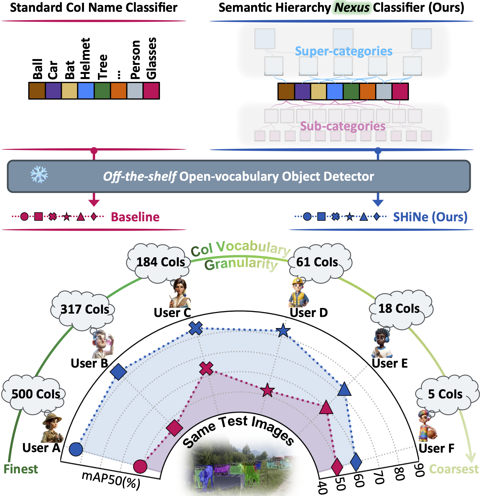
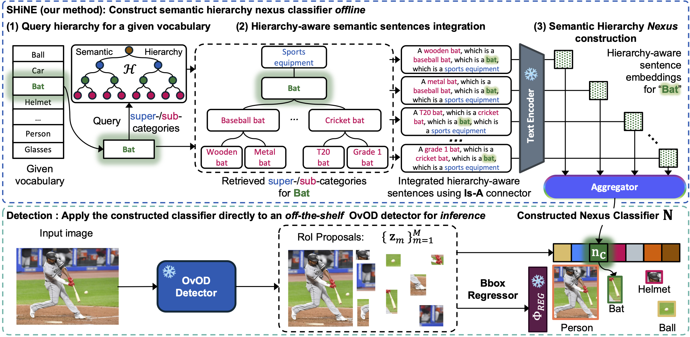

<!-- PROJECT LOGO -->

<p align="center">
  <h1 align="center"></h1>
  <h1 align="center">SHiNe: Semantic Hierarchy Nexus for Open-vocabulary Object Detection</h1>
  <p align="center">
    <a href="https://oatmealliu.github.io/"><strong>Mingxuan Liu</strong></a>
    ·
    <a href="https://tyler-hayes.github.io/"><strong>Tyler L. Hayes</strong></a>
    ·
    <a href="https://scholar.google.ca/citations?user=xf1T870AAAAJ&hl=en"><strong>Elisa Ricci</strong></a>
    ·
    <a href="https://scholar.google.fr/citations?user=PXm1lPAAAAAJ&hl=fr"><strong>Gabriela Csurka</strong></a>
    ·
    <a href="https://ricvolpi.github.io/"><strong>Riccardo Volpi</strong></a>
  </p>
  <h2 align="center">CVPR 2024 ✨Highlight✨</h2>
  <h3 align="center">
    <a href="https://arxiv.org/abs/2405.10053">Paper</a> |
    <a href="https://arxiv.org/abs/2405.10053">ArXiv</a> |
    <a href="https://github.com/naver/shine">Code</a> |
    <a href="">Poster (coming soon)</a>
  </h3> 
<div align="center"></div>
<p align="center">
<p>

<h1 align="center"></h1>


[//]: # (- [01/15/2024] Our work is accepted to <a href="https://iclr.cc/Conferences/2024"><strong>ICLR 2024</strong></a> 🌼! Code is coming soon. See you in Vienna this May!)

## Installation
Requirements:
- Linux or macOS with Python ≥ 3.8
- PyTorch ≥ 1.8.2.
  Install them together at [pytorch.org](https://pytorch.org) to make sure of this. Note, please check
  PyTorch version matches that is required by Detectron2.
- Detectron2: follow [Detectron2 installation instructions](https://detectron2.readthedocs.io/tutorials/install.html).
- OpenAI API (optional, if you want to construct hierarchies using LMMs)

Setup environment
```shell script
# Clone this project repository under your workspace folder
git clone https://github.com/OatmealLiu/SHiNe.git --recurse-submodules
# Create conda environment and install the dependencies
conda env create -n shine -f environment.yml
# Activate the working environment
conda activate shine
# Install Detectron2 under your workspace folder
# (Please follow Detectron2 official instructions)
cd ..
git clone git@github.com:facebookresearch/detectron2.git
cd detectron2
pip install -e .
```
Our project uses two submodules,
[CenterNet2](https://github.com/xingyizhou/CenterNet2.git)
and
[Deformable-DETR](https://github.com/fundamentalvision/Deformable-DETR.git).
If you forget to add `--recurse-submodules`, do `git submodule init` and then `git submodule update`.

Set your OpenAI API Key to the environment variable (optional: if you want to generate hierarchies)
```shell script
export OPENAI_API_KEY=YOUR_OpenAI_Key
```

## OvOD Models Preparation
SHiNe is training-free. So we just need to download off-the-shelf OvOD models and apply SHiNe on top of them. 
You can download the models:
- [Detic](https://github.com/facebookresearch/Detic)
- [VLDet](https://github.com/clin1223/VLDet)
- [CoDet](https://github.com/CVMI-Lab/CoDet/tree/main?tab=readme-ov-file)

and put (or, softlink via `ln -s` command) under the `models` folder in this repository as:
```shell script
SHiNe
    └── models
          ├── codet
            ├── CoDet_OVLVIS_R5021k_4x_ft4x.pth
            └── CoDet_OVLVIS_SwinB_4x_ft4x.pth
          ├── detic
            ├── coco_ovod
              ├── BoxSup_OVCOCO_CLIP_R50_1x.pth
              ├── Detic_OVCOCO_CLIP_R50_1x_caption.pth
              ├── Detic_OVCOCO_CLIP_R50_1x_max-size.pth
              └── Detic_OVCOCO_CLIP_R50_1x_max-size_caption.pth
            ├── cross_eval
              ├── BoxSup-C2_L_CLIP_SwinB_896b32_4x.pth
              ├── BoxSup-C2_LCOCO_CLIP_SwinB_896b32_4x.pth
              ├── Detic_LCOCOI21k_CLIP_SwinB_896b32_4x_ft4x_max-size.pth
              ├── Detic_LI21k_CLIP_SwinB_896b32_4x_ft4x_max-size.pth
              └── Detic_LI_CLIP_SwinB_896b32_4x_ft4x_max-size.pth
            ├── lvis_ovod
              ├── BoxSup-C2_Lbase_CLIP_R5021k_640b64_4x.pth
              ├── BoxSup-C2_Lbase_CLIP_SwinB_896b32_4x.pth
              ├── Detic_LbaseCCcapimg_CLIP_R5021k_640b64_4x_ft4x_max-size.pth
              ├── Detic_LbaseCCimg_CLIP_R5021k_640b64_4x_ft4x_max-size.pth
              ├── Detic_LbaseI_CLIP_R5021k_640b64_4x_ft4x_max-size.pth
              └── Detic_LbaseI_CLIP_SwinB_896b32_4x_ft4x_max-size.pth
            ├── lvis_std
              ├── BoxSup-C2_L_CLIP_R5021k_640b64_4x.pth
              ├── BoxSup-DeformDETR_L_R50_4x.pth
              ├── Detic_DeformDETR_LI_R50_4x_ft4x.pth
              └── Detic_LI_CLIP_R5021k_640b64_4x_ft4x_max-size.pth
          ├── vldet
            ├── lvis_base.pth
            ├── lvis_base_swinB.pth
            ├── lvis_vldet.pth
            └── lvis_vldet_swinB.pth
```


## Datasets Preparation
You can download the datasets:
- [iNat](https://drive.google.com/file/d/1Wav83umtIcITx9LqiWxh2LHXkZh3N40H/view?usp=drive_link): 17.8 GB
- [FSOD](https://drive.google.com/file/d/1XkdivbNsMSdOKk-zOMKjbudPo5VEvRjC/view?usp=drive_link): 14.7 GB
- [ImageNet-1k Val](https://drive.google.com/file/d/11cqx0wXjijnHyOXx7Coo2w1KfPVRuyL2/view?usp=drive_link): 6.2 GB
- [COCO](https://drive.google.com/file/d/1kE3meIjr5TtIbtre0GT0uMNkxcprEdmQ/view?usp=drive_link): 37.2 GB
- [LVIS](https://drive.google.com/file/d/1xyP5GIuFHaoo-J-zd9RHJ9tg6HSpug7I/view?usp=drive_link): 1.8 GB

and put (or, softlink via `ln -s` command) under the `datasets` folder in this repository as:
```shell script
SHiNe
    └── datasets
          ├── inat
          ├── fsod
          ├── imagenet2012
          ├── coco
          └── lvis
```


## Run SHiNe on OvOD
Example of applying SHiNe on Detic for OvOD task using iNat dataset:
```shell script
# Vanilla OvOD (baseline)
bash scripts_local/Detic/inat/swin/baseline/inat_detic_SwinB_LVIS-IN-21K-COCO_baseline.sh
 
# SHiNe using dataset-provided hierarchy
bash scripts_local/Detic/inat/swin/shine_gt/inat_detic_SwinB_LVIS-IN-21K-COCO_shine_gt.sh

# SHiNe using LLM-generated synthetic hierarchy
bash scripts_local/Detic/inat/swin/shine_llm/inat_detic_SwinB_LVIS-IN-21K-COCO_shine_llm.sh
```

## Run SHiNe on Zero-shot classification
Example of applying SHiNe on CLIP zero-shot transfer task using ImageNet-1k dataset:
```shell script
# Vanilla CLIP Zero-shot transfer (baseline)
bash scripts_local/Classification/imagenet1k/baseline/imagenet1k_vitL14_baseline.sh

# SHiNe using WordNet hierarchy
bash scripts_local/Classification/imagenet1k/shine_wordnet/imagenet1k_vitL14_shine_wordnet.sh

# SHiNe using LLM-generated synthetic hierarchy
bash scripts_local/Classification/imagenet1k/shine_llm/imagenet1k_vitL14_shine_llm.sh
```


## SHiNe Construction (optional)
Example of constructing SHiNe classifier for OvOD task using iNat dataset:
```shell script
# SHiNe using dataset-provided hierarchy
bash scripts_build_nexus/inat/build_inat_nexus_gt.sh
# SHiNe using LLM-generated synthetic hierarchy
bash scripts_build_nexus/inat/build_inat_nexus_llm.sh
```

## Hierarchy Tree Planting (optional)
Example of building hierarchy trees using either dataset-provided or llm-generated hierarchy entities.

### Dataset-provided Hierarchy
```shell script
# Build hierarchy tree for iNat using dataset-provided hierarchy
bash scripts_plant_hrchy/inat/plant_inat_tree_gt.sh

# Build hierarchy tree for ImageNet-1k using WordNet hierarchy
bash scripts_plant_hrchy/imagenet1k/plant_imagenet1k_tree_wordnet.sh
```

### LLM-generated Hierarchy
```shell script
# Build hierarchy tree for iNat using LLM-generated synthetic hierarchy
bash scripts_plant_hrchy/inat/plant_inat_tree_llm.sh

# Build hierarchy tree for ImageNet-1k using LLM-generated synthetic hierarchy
bash scripts_plant_hrchy/imagenet1k/plant_imagenet1k_tree_llm.sh
```

## License
This project is licensed under the [LICENSE](LICENSE.txt) file.

## Citation
If you find our work useful for your research, please cite our paper using the following BibTeX entry:
```bibtex
@inproceedings{liu2024shine,
  title={{SH}iNe: Semantic Hierarchy Nexus for Open-vocabulary Object Detection},
  author={Liu, Mingxuan and Hayes, Tyler and Ricci, Elisa and Csurka, Gabriela and Volpi, Riccardo},
  booktitle={Proceedings of the IEEE/CVF Conference on Computer Vision and Pattern Recognition},
  year={2024},
}
```

## Acknowledgment
SHiNe is built upon the awesome works
[iNat](https://github.com/visipedia/inat_loc),
[FSOD](https://github.com/fanq15/Few-Shot-Object-Detection-Dataset),
[BREEDS](https://github.com/MadryLab/BREEDS-Benchmarks),
[Hierarchy-CLIP](https://github.com/gyhandy/Hierarchy-CLIP),
[Detic](https://github.com/facebookresearch/Detic),
[VLDet](https://github.com/clin1223/VLDet),
and [CoDet](https://github.com/CVMI-Lab/CoDet).
We sincerely thank them for their work and contributions.

